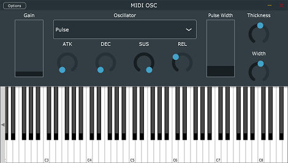

# MIDI-OSC

## What is it?

MIDI-Osc is a very simple real-time software synthesizer built using the JUCE framework. MIDI-Osc can run in standalone mode, or as a VST3 plugin for use
in a DAW of the users choice. MIDI-Osc supports 4 common oscialltor voicings, along with standard Attack, Decay, Sustain, and Release controls.
Additional controls include "Gain" to control the overall level, "Pulse Width" to control the tone of the Pulse oscillator, along with "Thickness" and "Width"
controls, which work in tandem to create interesting and unusual stereo widening effects on the basic oscillators.

## How does it work?
MIDI-Osc can be launched in standalone mode via `MIDI OSC.exe` in the 'Builds' folder. A VST version called `MIDI OSC.vst` also exists in the build folder,
where it can be loaded and played in any VST3-compatible digital audio workstation (DAW).

It can be played through the on-screen keyboard, or by an external hardware MIDI-controller. By clicking into the 'Options' menu in the top left corner,
you can select and modify a number of audio options, including the currently active MIDI input.

## Why did I make this?
This project was put together over the span of several months, as a final project for Harvard's online CS50 course.
MIDI-Osc was my first project delving into real-time audio, which is something I've been interested in for a long time.
I was also able to familiarize myself more with C++, which is a language I enjoy but can't often find a good reason to use.
It was a lot of fun learning some of the ins and outs of digital signal processing, so eventually I'd like to return to JUCE
for another project.